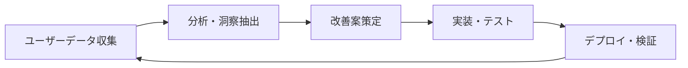

# 🛠️ インタラクティブチュートリアル実装ガイド

## 🎯 実装ロードマップ

### 📊 フェーズ別実装計画

#### 🥉 Phase 1: MVP (最小実行可能プロダクト) - 2-3週間
```javascript
const mvpFeatures = {
  core: [
    '基本チュートリアル（5ステップ）',
    'コードエディタ with リアルタイム検証',
    'シンプルなAPIシミュレーター', 
    '基本的な成果システム（5-10個）',
    '進度トラッキング'
  ],
  
  quickWins: [
    'ワンクリック例文ロード',
    'リアルタイムヒント表示',
    'エラーメッセージの分かりやすい翻訳',
    'ビジュアルフィードバック（成功/失敗アニメーション）'
  ]
};
```

#### 🥈 Phase 2: 機能拡張 - 4-6週間
```typescript
interface SilverFeatures {
  interactivity: {
    dragDropGeometry: boolean;    // ドラッグ&ドロップ立体配置
    realTime3D: boolean;          // リアルタイム3D可視化
    collaborativeMode: boolean;   // 基本的な協同機能
  };
  
  gamification: {
    levelSystem: boolean;         // レベル・XPシステム
    dailyChallenges: boolean;     // デイリーチャレンジ
    customization: boolean;       // アバター・テーマ
  };
  
  intelligence: {
    adaptiveDifficulty: boolean;  // 難易度自動調整
    personalizedHints: boolean;   // 個人化ヒント
    progressAnalytics: boolean;   // 学習分析
  };
}
```

#### 🥇 Phase 3: 完全システム - 8-12週間
```python
class FullPlatform:
    def __init__(self):
        self.ai_tutor = AITutorSystem()
        self.vr_integration = VRLearningEnvironment()
        self.community_platform = CommunitySystem()
        self.certification_system = CertificationEngine()
```

## 🚀 即実行可能なクイックスタート

### ⚡ 15分でできる最小セットアップ

```bash
# 1. プロジェクト初期化
npx create-react-app poker-tutorial-proto --template typescript
cd poker-tutorial-proto

# 2. 必要ライブラリインストール
npm install @codemirror/view @codemirror/lang-json @codemirror/state

# 3. 基本コンポーネント作成
mkdir src/components
touch src/components/InteractiveTutorial.tsx
touch src/components/CodeEditor.tsx
touch src/components/Simulator.tsx
```

### 📝 最小実装例

```typescript
// src/components/MinimalTutorial.tsx
import React, { useState } from 'react';

const MinimalInteractiveTutorial: React.FC = () => {
  const [userCode, setUserCode] = useState('');
  const [result, setResult] = useState<any>(null);
  const [step, setStep] = useState(0);

  const steps = [
    {
      title: '基本的な線源作成',
      instruction: 'Co-60線源を作成するJSONを完成させてください',
      template: `{
  "jsonrpc": "2.0",
  "method": "pokerinput_proposeSource",
  "params": {
    "name": "___ここに線源名___",
    "type": "point",
    "position": "0 0 100",
    "inventory": [{"nuclide": "Co-60", "radioactivity": 3.7e10}]
  },
  "id": 1001
}`,
      expectedAnswer: 'my_co60_source'
    }
  ];

  const executeCode = () => {
    try {
      const parsed = JSON.parse(userCode);
      
      if (parsed.method === 'pokerinput_proposeSource' && 
          parsed.params?.name) {
        setResult({ 
          success: true, 
          message: `線源 "${parsed.params.name}" の作成に成功しました！` 
        });
      } else {
        setResult({ 
          success: false, 
          error: '必要なパラメータが不足しています' 
        });
      }
    } catch (e) {
      setResult({ 
        success: false, 
        error: 'JSON構文エラー: ' + (e as Error).message 
      });
    }
  };

  return (
    <div style={{ padding: '20px', maxWidth: '1200px', margin: '0 auto' }}>
      <h1>🎮 Poker MCP インタラクティブチュートリアル</h1>
      
      <div style={{ display: 'grid', gridTemplateColumns: '1fr 1fr', gap: '20px' }}>
        {/* 左側: 指示とコードエディタ */}
        <div>
          <div style={{ marginBottom: '20px', padding: '15px', backgroundColor: '#f0f8ff', borderRadius: '8px' }}>
            <h3>{steps[step].title}</h3>
            <p>{steps[step].instruction}</p>
          </div>
          
          <textarea
            value={userCode}
            onChange={(e) => setUserCode(e.target.value)}
            placeholder="ここにJSONコードを入力してください..."
            style={{
              width: '100%',
              height: '300px',
              fontFamily: 'monospace',
              fontSize: '14px',
              padding: '10px',
              border: '1px solid #ddd',
              borderRadius: '4px'
            }}
          />
          
          <button 
            onClick={executeCode}
            style={{
              marginTop: '10px',
              padding: '10px 20px',
              backgroundColor: '#007bff',
              color: 'white',
              border: 'none',
              borderRadius: '4px',
              cursor: 'pointer'
            }}
          >
            🚀 実行
          </button>
        </div>

        {/* 右側: 結果表示 */}
        <div>
          <h3>実行結果</h3>
          {result && (
            <div style={{
              padding: '15px',
              borderRadius: '8px',
              backgroundColor: result.success ? '#d4edda' : '#f8d7da',
              color: result.success ? '#155724' : '#721c24',
              border: `1px solid ${result.success ? '#c3e6cb' : '#f5c6cb'}`
            }}>
              {result.success ? '✅ ' : '❌ '}
              {result.message || result.error}
            </div>
          )}
          
          <div style={{ marginTop: '20px', padding: '15px', backgroundColor: '#fff3cd', borderRadius: '8px' }}>
            <h4>💡 テンプレート</h4>
            <pre style={{ fontSize: '12px', overflow: 'auto' }}>
              {steps[step].template}
            </pre>
          </div>
        </div>
      </div>
    </div>
  );
};

export default MinimalInteractiveTutorial;
```

### 🔧 App.tsx の更新

```typescript
// src/App.tsx
import React from 'react';
import MinimalInteractiveTutorial from './components/MinimalTutorial';

function App() {
  return (
    <div className="App">
      <MinimalInteractiveTutorial />
    </div>
  );
}

export default App;
```

### ▶️ 実行

```bash
npm start
```

## 📈 段階的機能拡張

### Week 1: 基本インタラクション
```typescript
// 追加機能
const enhancements = {
  week1: [
    'ステップナビゲーション',
    'プログレスバー',
    'ヒントシステム',
    'コード例の自動ロード'
  ]
};
```

### Week 2: ビジュアル改善
```typescript
// UI/UX改善
const visualImprovements = {
  week2: [
    'CodeMirror統合（シンタックスハイライト）',
    'アニメーション効果',
    'レスポンシブデザイン',
    'アクセシビリティ対応'
  ]
};
```

### Week 3: ゲーミフィケーション
```typescript
// ゲーム要素追加
const gamification = {
  week3: [
    '成果システム',
    'レベル・経験値',
    'チャレンジ機能',
    'プロフィール・カスタマイゼーション'
  ]
};
```

## 🧪 ユーザーテスト実施

### 📋 テスト計画（Week 2）

```markdown
## ユーザーテスト実施要項

### 参加者
- 放射線研究初心者: 3名
- 既存Poker MCPユーザー: 2名
- 合計5名、各30分セッション

### テスト項目
1. 初見での理解しやすさ（10分）
2. 基本操作の習得速度（10分）
3. エラー時の対処能力（5分）
4. 総合的な学習体験（5分）

### 測定指標
- タスク完了時間
- エラー発生回数
- ヒント使用回数
- 主観的満足度（1-5段階）
- 改善提案の質・量

### 収集データ
- 操作ログ（全クリック・入力）
- 音声録音（Think Aloud）
- スクリーン録画
- 事後インタビュー
```

### 📊 フィードバック分析

```javascript
// フィードバック集計・分析
const feedbackAnalysis = {
  common_issues: [
    'JSON構文エラーの理解困難',
    'パラメータ名の記憶負荷',
    'エラーメッセージの専門性'
  ],
  
  positive_feedback: [
    '即座のフィードバックが helpful',
    'ステップ分けで理解しやすい',
    'テンプレート機能が便利'
  ],
  
  improvement_suggestions: [
    'より詳細なヒント',
    '成功時のより明確な祝福',
    '次ステップへの自然な誘導'
  ]
};
```

## 🔄 継続的改善プロセス

### 📊 週次改善サイクル



### 🎯 改善指標

```typescript
interface ImprovementMetrics {
  learning_effectiveness: {
    completion_rate: number;        // 完了率
    average_time: number;           // 平均学習時間
    error_rate: number;             // エラー発生率
    retention_rate: number;         // 知識定着率
  };
  
  user_experience: {
    satisfaction_score: number;     // 満足度スコア
    engagement_time: number;        // エンゲージメント時間
    return_rate: number;            // 再訪率
    recommendation_score: number;   // 推奨度（NPS）
  };
  
  technical_performance: {
    load_time: number;              // ページ読み込み時間
    error_frequency: number;        // 技術的エラー頻度
    uptime: number;                 // 稼働率
    api_response_time: number;      // API応答時間
  };
}
```

## 🚀 本格実装への移行

### Month 2: フル機能開発

```bash
# より高度な開発環境セットアップ
npm install three @react-three/fiber @react-three/drei
npm install framer-motion recharts socket.io-client
npm install @testing-library/react cypress
npm install storybook
```

### 🏗️ アーキテクチャ設計

```typescript
// 本格的なアーキテクチャ
interface TutorialArchitecture {
  frontend: {
    framework: 'React + TypeScript';
    state_management: 'Zustand';
    styling: 'Tailwind CSS';
    animation: 'Framer Motion';
    3d_graphics: 'Three.js';
    testing: 'Jest + Cypress';
  };
  
  backend: {
    api: 'FastAPI + Python';
    database: 'PostgreSQL';
    cache: 'Redis';
    websocket: 'Socket.IO';
    analytics: 'Elasticsearch';
  };
  
  infrastructure: {
    hosting: 'AWS / Vercel';
    cdn: 'CloudFront';
    monitoring: 'Sentry';
    ci_cd: 'GitHub Actions';
  };
}
```

## 📚 学習リソース・参考資料

### 🔗 技術学習
- **React公式ドキュメント**: https://react.dev/
- **TypeScript Handbook**: https://www.typescriptlang.org/docs/
- **Three.js Journey**: https://threejs-journey.com/
- **Framer Motion**: https://www.framer.com/motion/

### 🎮 ゲーミフィケーション
- **Gamification Design**: Yu-kai Chou著『Actionable Gamification』
- **UX for Games**: 『Art of Game Design』Jesse Schell著
- **Learning Science**: 『Make It Stick』Peter Brown著

### 📊 分析・改善
- **Google Analytics 4**: 基本的な利用者行動分析
- **Hotjar**: ヒートマップ・ユーザーセッション録画
- **Amplitude**: 高度な行動分析・コホート分析

---

**🎯 重要**: 完璧を目指さず、早期にユーザーフィードバックを得ることが成功の鍵です！

**✨ 次のステップ**: まずは15分の最小セットアップから始めて、週次でユーザーテストを実施しながら段階的に機能を拡張していきましょう。
