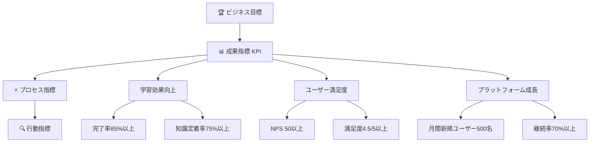

# 📊 成功指標・KPI設定

## 🎯 KPI全体設計

### 🌟 測定哲学
```typescript
interface MeasurementPhilosophy {
  user_centric: "ユーザーの学習体験が最優先";
  data_driven: "すべての改善判断はデータに基づく";
  actionable: "測定結果から具体的なアクションを導く";
  continuous: "継続的な測定・改善サイクル";
}
```

### 📈 KPI階層構造



## 🎯 主要KPI定義

### 🏆 Tier 1: ビジネス成果指標

```typescript
interface BusinessKPIs {
  learning_effectiveness: {
    metric: "チュートリアル完了率";
    target: "85%以上";
    current_baseline: "40%"; // 従来の学習方法
    measurement: "完了者数 / 開始者数";
    timeframe: "月次";
  };
  
  knowledge_retention: {
    metric: "知識定着率";
    target: "75%以上";
    current_baseline: "45%";
    measurement: "1週間後テスト正答率";
    timeframe: "週次";
  };
  
  user_satisfaction: {
    metric: "ユーザー満足度";
    target: "4.5/5以上";
    current_baseline: "3.2/5";
    measurement: "5段階評価の平均";
    timeframe: "週次";
  };
  
  platform_growth: {
    metric: "月間アクティブユーザー数";
    target: "前月比15%増";
    current_baseline: "N/A (新サービス)";
    measurement: "月内に1回以上利用したユーザー数";
    timeframe: "月次";
  };
}
```

### ⚡ Tier 2: プロセス指標

```typescript
interface ProcessKPIs {
  engagement: {
    session_duration: {
      metric: "平均セッション時間";
      target: "25分以上";
      description: "ユーザーが集中して学習している時間";
    };
    
    step_completion_rate: {
      metric: "ステップ別完了率";
      target: "各ステップ90%以上";
      description: "各学習ステップでの脱落率を最小化";
    };
    
    hint_usage_rate: {
      metric: "ヒント利用率";
      target: "30-60%";
      description: "適切なサポートレベルの指標";
    };
  };
  
  performance: {
    page_load_time: {
      metric: "ページ読み込み時間";
      target: "2秒以下";
      description: "ユーザー体験の基本品質";
    };
    
    api_response_time: {
      metric: "API応答時間";
      target: "500ms以下";
      description: "リアルタイム性の確保";
    };
    
    error_rate: {
      metric: "エラー発生率";
      target: "1%以下";
      description: "システム安定性の指標";
    };
  };
  
  quality: {
    code_quality_score: {
      metric: "ユーザーコード品質スコア";
      target: "平均8.0/10以上";
      description: "学習成果の質的評価";
    };
    
    first_try_success_rate: {
      metric: "初回成功率";
      target: "60%以上";
      description: "説明・UI設計の分かりやすさ";
    };
  };
}
```

### 🔍 Tier 3: 行動指標

```typescript
interface BehaviorKPIs {
  learning_patterns: {
    daily_active_users: "DAU (日次アクティブユーザー)";
    weekly_active_users: "WAU (週次アクティブユーザー)";
    monthly_active_users: "MAU (月次アクティブユーザー)";
    retention_day_1: "1日後継続率";
    retention_day_7: "7日後継続率";
    retention_day_30: "30日後継続率";
  };
  
  feature_adoption: {
    achievement_unlock_rate: "成果アンロック率";
    community_participation: "コミュニティ参加率";
    advanced_feature_usage: "高度機能利用率";
    customization_usage: "カスタマイゼーション利用率";
  };
  
  support_metrics: {
    help_request_rate: "ヘルプ要求率";
    documentation_access: "ドキュメント閲覧率";
    community_question_rate: "コミュニティ質問率";
    support_resolution_time: "サポート解決時間";
  };
}
```

## 📊 測定方法・ツール

### 🔧 データ収集戦略

```typescript
// Frontend Analytics Implementation
class TutorialAnalytics {
  constructor() {
    this.posthog = posthog;
    this.sentry = Sentry;
  }

  // 学習進度追跡
  trackLearningProgress(event: LearningEvent) {
    this.posthog.capture('learning_progress', {
      step_id: event.stepId,
      completion_time: event.completionTime,
      attempts_count: event.attemptsCount,
      hints_used: event.hintsUsed,
      success: event.success,
      user_id: event.userId,
      timestamp: new Date().toISOString()
    });
  }

  // コード品質測定
  trackCodeQuality(code: string, stepId: number) {
    const qualityMetrics = this.analyzeCodeQuality(code);
    
    this.posthog.capture('code_quality', {
      step_id: stepId,
      complexity_score: qualityMetrics.complexity,
      readability_score: qualityMetrics.readability,
      best_practices_score: qualityMetrics.bestPractices,
      overall_score: qualityMetrics.overall
    });
  }

  // ユーザー体験測定
  trackUserExperience() {
    // Web Vitals
    getCLS((metric) => this.posthog.capture('web_vital_cls', metric));
    getFID((metric) => this.posthog.capture('web_vital_fid', metric));
    getLCP((metric) => this.posthog.capture('web_vital_lcp', metric));
    
    // カスタム UX メトリクス
    this.trackInteractionLatency();
    this.trackFeatureDiscoverability();
  }

  // エラー・問題点追跡
  trackErrors(error: Error, context: object) {
    this.sentry.captureException(error, {
      contexts: { tutorial: context },
      tags: { source: 'interactive_tutorial' }
    });
  }
}
```

### 📈 ダッシュボード設計

```typescript
interface AnalyticsDashboard {
  executive_dashboard: {
    update_frequency: "毎日";
    audience: "経営陣・プロダクト責任者";
    metrics: [
      "月間アクティブユーザー数",
      "チュートリアル完了率",
      "ユーザー満足度",
      "収益への影響 (間接的)"
    ];
  };
  
  product_dashboard: {
    update_frequency: "リアルタイム";
    audience: "プロダクトマネージャー・デザイナー";
    metrics: [
      "ファネル分析",
      "機能別利用状況",
      "ユーザージャーニー",
      "A/Bテスト結果"
    ];
  };
  
  engineering_dashboard: {
    update_frequency: "リアルタイム";
    audience: "エンジニア・DevOps";
    metrics: [
      "システムパフォーマンス",
      "エラー率・応答時間",
      "インフラコスト",
      "セキュリティ指標"
    ];
  };
}
```

## 🎯 成功基準・マイルストーン

### 📅 フェーズ別目標

```typescript
interface PhaseTargets {
  mvp_phase: {
    duration: "最初の3ヶ月";
    primary_goals: [
      "基本機能の安定動作",
      "初期ユーザーからのフィードバック収集",
      "技術的実現可能性の検証"
    ];
    success_criteria: {
      user_completion_rate: "60%以上";
      system_uptime: "99%以上";
      user_satisfaction: "4.0/5以上";
      critical_bugs: "月5件以下";
    };
  };
  
  growth_phase: {
    duration: "4-9ヶ月目";
    primary_goals: [
      "ユーザーベース拡大",
      "機能拡充・改善",
      "コミュニティ形成"
    ];
    success_criteria: {
      monthly_new_users: "500名以上";
      completion_rate: "75%以上";
      retention_rate: "60%以上 (7日後)";
      nps_score: "40以上";
    };
  };
  
  maturity_phase: {
    duration: "10-12ヶ月目";
    primary_goals: [
      "業界標準の確立",
      "持続可能な成長",
      "企業・教育機関への展開"
    ];
    success_criteria: {
      completion_rate: "85%以上";
      knowledge_retention: "75%以上";
      user_satisfaction: "4.5/5以上";
      enterprise_adoption: "10社以上";
    };
  };
}
```

### 🚨 アラート・エスカレーション

```typescript
interface AlertConfiguration {
  critical_alerts: {
    completion_rate_drop: {
      threshold: "前週比20%以上低下";
      action: "即座にプロダクト責任者に通知";
      escalation: "2時間以内に対応計画策定";
    };
    
    system_error_spike: {
      threshold: "エラー率5%以上";
      action: "エンジニアに即座通知";
      escalation: "30分以内に原因調査開始";
    };
    
    user_satisfaction_drop: {
      threshold: "満足度4.0以下";
      action: "ユーザー体験チームに通知";
      escalation: "1日以内に改善計画策定";
    };
  };
  
  warning_alerts: {
    engagement_decline: {
      threshold: "平均セッション時間20%以上短縮";
      action: "プロダクトチームで分析";
      escalation: "1週間以内に対策実施";
    };
    
    feature_adoption_low: {
      threshold: "新機能利用率30%以下";
      action: "UXチームで調査";
      escalation: "2週間以内に改善案実装";
    };
  };
}
```

## 📊 レポート・分析頻度

### 📅 定期レポートスケジュール

```typescript
interface ReportingSchedule {
  daily_reports: {
    time: "毎朝9時";
    recipients: ["プロダクトマネージャー", "エンジニアリーダー"];
    content: [
      "前日のユーザー活動サマリ",
      "システムパフォーマンス",
      "クリティカルイシューの状況"
    ];
  };
  
  weekly_reports: {
    time: "毎週月曜日";
    recipients: ["全チーム", "ステークホルダー"];
    content: [
      "週次KPI達成状況",
      "ユーザーフィードバック分析",
      "機能改善の進捗",
      "次週の重点項目"
    ];
  };
  
  monthly_reports: {
    time: "月初第1営業日";
    recipients: ["経営陣", "全関係者"];
    content: [
      "月次業績サマリ",
      "ロードマップ進捗",
      "競合分析・市場動向",
      "次月の戦略・計画"
    ];
  };
}
```

---

**🎯 測定の原則**: 
- **ユーザー中心**: 技術指標ではなく、ユーザー価値を最優先
- **アクショナブル**: 測定結果から具体的な改善アクションを導く
- **継続的改善**: 定期的な目標見直しと基準更新
- **バランス**: 量的指標と質的指標のバランスを保つ

**✨ 重要ポイント**: 完璧な測定よりも、継続的な改善サイクルを回すことが成功の鍵です！