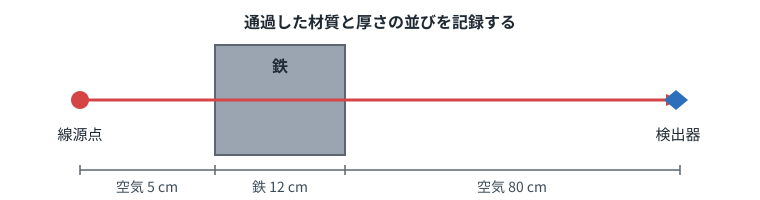
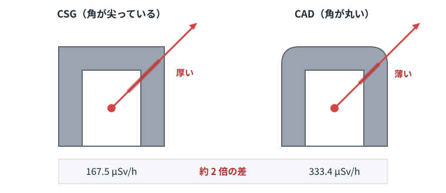
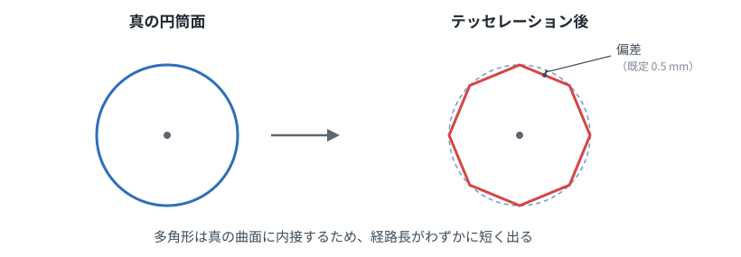

# CAD 連携クイックスタート

CAD モデルから直接、遮蔽計算をするための最短手順です。技術的な詳細は
[CAD_RAYTRACE.md](CAD_RAYTRACE.md)、フォーマットは [PATHS_FORMAT.md](PATHS_FORMAT.md)
を参照してください。

## 必要なもの

| | 入手先 | 備考 |
|---|---|---|
| poker-mcp | `npm install poker-mcp` | v1.8.3 以降 |
| POKER 本体 | 別途入手 | v2.1.5 以降 |
| FreeCAD | [freecad.org](https://www.freecad.org/) | 無償。1.0 以降 |

numpy は FreeCAD に同梱されているので追加のインストールは不要です。

```json
"env": {
  "POKER_MCP_HOME": "C:\\Users\\yourname\\poker_workspace",
  "POKER_INSTALL_PATH": "C:\\Poker",
  "FREECAD_PATH": "C:\\Program Files\\FreeCAD 1.1"
}
```

`FREECAD_PATH` は既定の場所にインストールされていれば省略できます。

## 仕組み

線源から検出器へ直線を引き、途中で何をどれだけ通過したかを記録します。



この並びを `.paths` ファイルに書き出して POKER に渡します。CAD の形状がどれだけ
複雑でも、直線との交差さえ求められればよいので、フィレットでも自由曲面でも
扱えます。

## 手順

CAD が正本です。**YAML を手で書く必要はありません。**

```javascript
poker_generateInput({ fcstd: "C:/path/to/model.FCStd" })   // YAML を生成
poker_generatePaths({ fcstd: "C:/path/to/model.FCStd" })   // 経路を抽出
poker_executeCalculation({ yaml_file: "poker.yaml", path_input: "poker.paths" })
```

### CAD 側の約束

ソリッドにカスタムプロパティを設定します。これだけが利用者の仕事です。

| プロパティ | 対象 | 内容 |
|---|---|---|
| `PokerRole` | 全体 | `shield`（既定）/ `source` / `detector` |
| `PokerMaterial` | 遮蔽体 | 材質名（`Iron`、`Concrete` など） |
| `PokerDensity` | 遮蔽体 | 密度の上書き [g/cm³]。省略時はカタログ密度 |
| `PokerNuclides` | 線源 | `"Cs137:1.0e13, Co60:5.0e11"` |
| `PokerDivision` | 線源・検出器 | 分割数。省略時は自動（後述） |
| `PokerCutoff` | 線源 | 打ち切り率。既定 1e-4 |
| `PokerShowPathTrace` | 検出器 | 既定 false |

汚染を散布する場合は次も使えます（後述）。

| プロパティ | 対象 | 内容 |
|---|---|---|
| `PokerSourceType` | 線源 | `volume` で体積汚染として散布 |
| `PokerInnerNuclides` | 線源 | 内面の汚染密度 [Bq/cm²] |
| `PokerOuterNuclides` | 線源 | 外面の汚染密度 [Bq/cm²] |
| `PokerComposition` | 線源 | 組成比（`Cs137:5, Co60:1`） |
| `PokerConcentration` | 線源 | 総濃度。`PokerComposition` と併用 |
| `PokerActivity` | 線源 | 総放射能 [Bq]（濃度でなく総量で与える場合） |
| `PokerPointSpacing` | 線源 | 点の間隔 [mm]。省略時は自動 |
| `PokerRegionFor` | 領域 | 汚染範囲を限る立体が指す対象（リンク） |

```python
o.addProperty('App::PropertyString', 'PokerMaterial', 'POKER', '材質')
o.PokerMaterial = 'Iron'
```

### 形状から決まるもの

**線源と検出器の型は、ソリッドの形から判定されます。** 面の数ではなく曲面の
種別（円柱面・球面・平面）で判定するので、傾いた円柱も正しく扱えます。

| CAD の形 | 線源として | 検出器として |
|---|---|---|
| 球・小さい立体 | POINT（1 cm³ 未満）/ SPH | 点検出器 |
| 円柱 | RCC（軸と底面を自動取得） | — |
| 薄い直方体 | BOX | **2D グリッド**（面線量マップ） |
| 直方体 | BOX | **3D グリッド**（体積線量マップ） |

円錐やトーラスなど POKER に対応する型がない形状は、**黙って近似せずエラーに
します**。気づかないまま違う体系を計算するより安全です。

### 自動で決まるもの

**子孫核種**が補完されます。Cs137 は β 崩壊のみで光子をほぼ出さず、0.662 MeV は
娘核種 Ba137m から出ます。忘れると線量が 1/3 になるため、`DaughterReconciler`
を通して自動で追加します。

**線源の分割数**は、1 区画が 2 mfp 以下になるよう寸法と材質から決まります。
`PokerDivision` で上書きできます。

```
キャスク相当（Source_Dry, r=75cm, h=400cm）-> r=8, phi=16, z=41
```

これは出発点であって最適値ではありません。**本来は分割数を変えて線量の収束を
確認して決めるもの**です。

**参照エネルギー**は線源の核種から光子放出率で重み付けした平均を使います。
層の縮約に使う値で、線量計算には影響しません。

**`thinnedindices`** は分割点数・評価点数に合わせて設定されます。`.paths` の
生成には全点が必要ですが、既定では間引かれるためです。

### 生成物の検証

`poker_generateInput` は生成直後に `poker_cui -c` を走らせ、結果を返します。

```json
"validation": { "ok": true, "message": "poker_cui -c で検証を通過しました" }
```

材質名がライブラリに無いといった誤りを、計算まで進む前に捕まえられます。

### 既存の YAML

上書きされますが、`backups/` に退避されます（`applyChanges` と同じ場所）。
CAD が正本なので YAML は生成物であり、毎回確認を求めるのは煩わしいだけという
判断です。

## 汚染の散布（不定形な線源）

POKER の線源型（POINT / SPH / RCC / RPP / BOX）で表現できない形状も、
**点線源を散布すれば扱えます**。曲がった配管の内部、不定形な廃棄物、
床に広がった汚染など。

指定した汚染密度と矛盾しないよう強度を配分するので、総放射能は保存されます。

### 体積汚染

```python
fluid.PokerRole = 'source'
fluid.PokerSourceType = 'volume'
fluid.PokerNuclides = 'Cs137:1.0e6, Co60:2.0e5'   # Bq/cm3
```

形状の内部に格子状に点を置き、`総放射能 ÷ 点数` を各点に配分します。
総放射能は `汚染密度 × Shape.Volume` なので、**体積が正確なら総量も正確**です。

### 表面汚染

内面と外面を別々に指定できます。配管なら、流体由来の内面汚染と、漏洩などに
よる外面汚染が同時にあり得ます。

```python
wall.PokerRole = 'source'
wall.PokerInnerNuclides = 'Cs137:1.0e4, Co60:2.0e3'   # Bq/cm2
wall.PokerOuterNuclides = 'Cs137:5.0e2'               # Bq/cm2
```

内面・外面は形状から自動判別します。**端面（配管の切断面）は除外されます**。
実務では配管はつながっていて、端面が露出することはまずないためです。

面のパラメータ空間を刻んで点を置きますが、**等間隔に刻んでも面上で等間隔とは
限りません**。球面では極付近でセルが潰れ、面積が 4 倍以上ばらつきます。
そのため各セルの面積で重み付けしています。平面と円筒では重みが一様になるので、
床や配管では面積等分と同じ結果です。

### 組成が既知で濃度だけ違う場合

```python
fluid.PokerComposition = 'Cs137:5, Co60:1'   # 比率（単位は不問）
fluid.PokerConcentration = '1.2e5'           # Bq/cm3（合計）
```

比率の合計で正規化して配分します。上の例なら Cs137 が 5/6、Co60 が 1/6。

### 汚染範囲を限る

形状の一部だけが汚染している場合、**その範囲を立体で囲みます**。

```python
region = doc.addObject('Part::Feature', 'ContaminatedArea')
region.Shape = Part.makeBox(300, 300, 200, App.Vector(-150, 100, 350))
region.addProperty('App::PropertyLink', 'PokerRegionFor', 'POKER', '')
region.PokerRegionFor = wall      # 対象をリンクで指す
```

自由曲面に「この範囲が汚染」という面を貼り付けるのは GUI では困難ですが、
**箱を置くだけ**なら簡単です。MCNP のクッキーカッター（サンプリング領域を
別セルで制限する手法）と同じ考え方です。

リンク（`App::PropertyLink`）で指すので、オブジェクト名を変えても壊れません。

### 点の間隔

省略すると、**最も近い検出器までの距離の 1/10** になります。点線源近似では
線源片の大きさが距離に対して十分小さい必要があり、1/10 なら立体角の誤差が
1% 程度に収まります。形状の最短辺の 1/4 が上限です。

```python
fluid.PokerPointSpacing = '20'    # mm
```

点数が 1 万を超えると警告が出ます（計算は続行します）。1,000 点で約 10 秒、
3,000 点で約 34 秒が目安です。

### 線源が遮蔽体でもある場合

表面汚染した配管の管壁は、**線源であると同時に遮蔽体**です。
`PokerMaterial` を設定しておけば、遮蔽体としても登録されます。

```python
wall.PokerRole = 'source'
wall.PokerMaterial = 'SUS_A'      # これを忘れると管壁が透明になる
wall.PokerInnerNuclides = 'Cs137:1.0e4'
```

忘れると自己遮蔽が効かず、**線量を過大評価します**（実測で 4 割）。

## サンプル

`tools/samples/` に、記事で使った最小サンプルがあります。

| ファイル | 内容 |
|---|---|
| `make_sample.py` | 鉄の箱（60x60x40 cm、角を R5cm でフィレット）を作る |
| `sample_shield.yaml` | 対応する POKER 入力（Co60 1Ci、検出器 3 点） |

```
"C:\Program Files\FreeCAD 1.1\bin\freecadcmd.exe" tools/samples/make_sample.py
```

### 結果



| 検出器 | CAD 経由 | CSG 経由 | 比 |
|---|---|---|---|
| 上面 1 m | 763.6 | 763.6 | 1.00 |
| 側面 1 m | 650.3 | 650.3 | 1.00 |
| **角方向** | **333.4** | **167.5** | **1.99** |

平坦な面を垂直に抜ける経路は完全に一致します。角方向だけ約 2 倍の差が出るのは、
角を R5cm で丸めた分だけ鉄が薄くなっているためで、CSG（角が尖った箱）ではその
薄さを表現できていません。**CSG 側が線量を半分に見積もっていた**ことになります。

形状の簡略化が線量をどれだけ動かすかは事前には分かりません。CAD 連携を使えば、
簡略化そのものが不要になります。

### そのまま追試できる一式

記事で使ったファイルを、入力・モデル・経路まで揃えて置いてあります。

| フォルダ | 内容 |
|---|---|
| `tools/samples/article_fillet/` | 上の比較の一式。CSG 入力、フィレット付き FCStd、経路 |
| `tools/samples/article_pipe/` | 曲がった配管。内面・外面・流体の3種類の汚染 |

同梱の `poker.yaml` と `poker.paths` だけで、**CAD 無しに計算を再現**できます。

```
# フィレットの比較
cd tools/samples/article_fillet
POKER_CUI.exe poker.yaml -t -o csg.summary
POKER_CUI.exe poker.yaml --path-input poker.paths -t -o cad.summary

# 配管
cd tools/samples/article_pipe
POKER_CUI.exe poker.yaml --path-input poker.paths -t -o out.summary
```

各フォルダの README に体系と結果をまとめてあります。

## 精度

CAD の曲面は計算前に三角形の集まりに変換されます（テッセレーション）。



多角形は真の曲面に内接するので、経路長がわずかに短く出ます。既定の偏差 0.5 mm
での実測値です。

| 体系 | 曲面 | CSG 経由との差 |
|---|---|---|
| 鉄平板 | なし | 0.005% |
| 円筒容器 | 円筒 | 0.23% |
| 球殻 | 球 | 0.63% |

球は 2 方向に曲がっているため、円筒より差が大きくなります。球面や複曲面が主体の
体系では偏差を下げてください。

```javascript
poker_generatePaths({ fcstd: "...", deviation: 0.1 })
```

球殻の実測で、0.1 mm なら 0.045%、0.02 mm なら 0.036% まで縮みます。

## 使いどころ

**向いている場面**: CSG で表現しにくい形状（フィレット、自由曲面、多数の貫通孔）。
簡略化の妥当性を確認したいとき。既存の設計データ（STEP）を使いたいとき。

**向いていない場面**: 評価点が非常に多い体系。経路数は「線源分割点 x 検出器
評価点」に比例するので、3D グリッド検出器のような体系では成立しません。

目安は線源 3,840 点 x 検出器 15 点 = 57,600 経路で約 20 秒です。

**従来の CSG 入力を置き換えるものではなく、使い分けてください。**

## 他の CAD で作ったモデル

SolidWorks、Inventor、Fusion 360、Rhino などのモデルも使えます。

1. 元の CAD で STEP 形式に書き出す
2. FreeCAD で開く
3. 各ソリッドに `PokerMaterial` を設定する
4. `.FCStd` として保存する

3 が必要なのは、**STEP では材質情報が運べない**ためです。FreeCAD の STEP 書き出しは
AP214 形式で、材質エンティティを含みません。残るのはソリッド名だけです。

一度設定すれば `.FCStd` に保存されるので、次回以降は不要です。

## 困ったときは

[TROUBLESHOOTING.md](TROUBLESHOOTING.md) の第 2.6 章に、よくある 6 件をまとめて
あります。

| 症状 | 対処 |
|---|---|
| FreeCAD が見つかりません | `FREECAD_PATH` を設定 |
| count / position mismatch | 入力を変えたら `.paths` を再生成 |
| 評価点が間引かれています | `poker_updateThinnedIndices({ fit_for_paths: true })` |
| CSG 経由と差が出る | まずテッセレーション偏差を疑う |